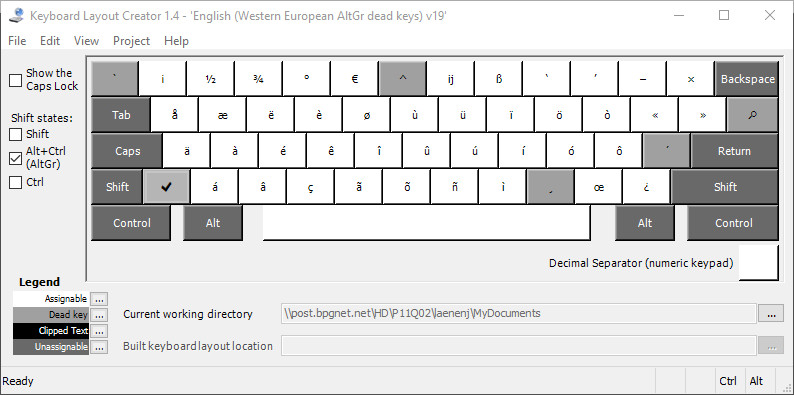
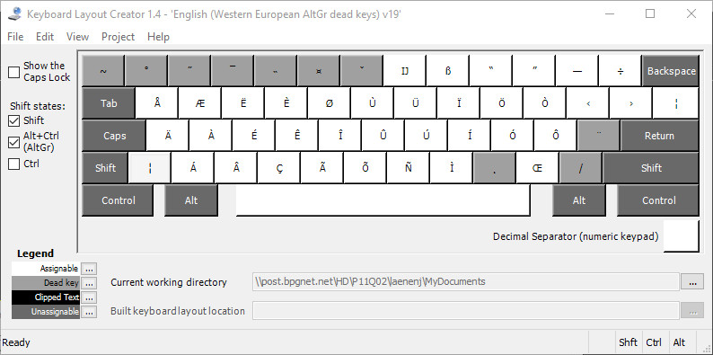

A western european keyboard layout for Windows, with AltGr dead keys and precomposed diacritics, made with Microsoft Keyboard Layout Creator, inspired by https://choam.eu/altgr-intl and https://github.com/thomasfaingnaert/win-us-intl-altgr .

